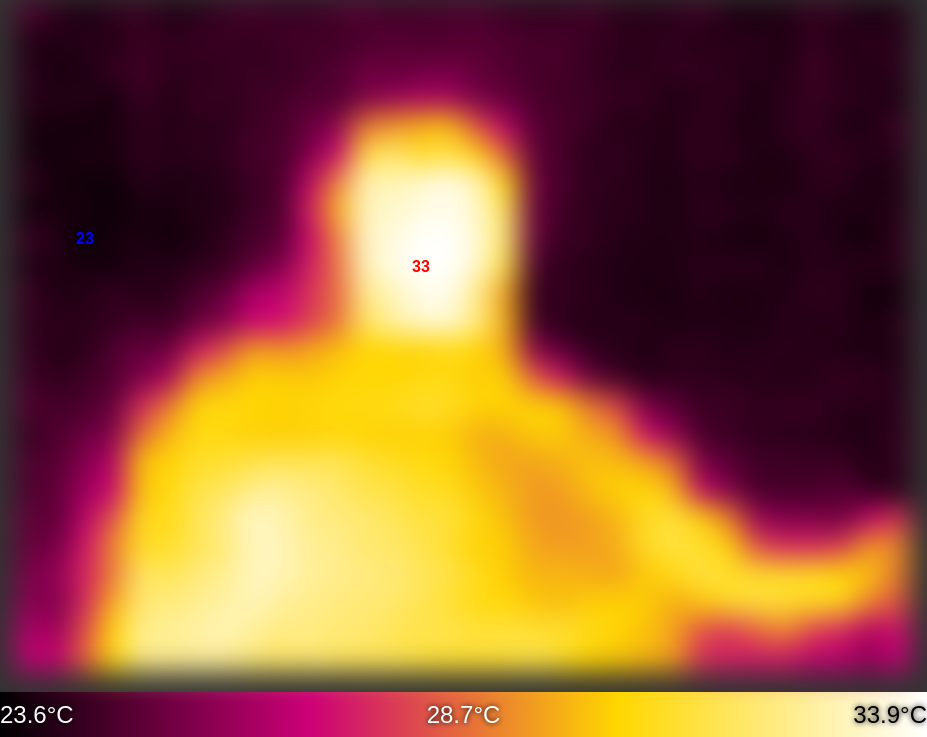

# MicroPython Driver for MLX90640 IR Camera



## Introduction

This repository contains a MicroPython driver for the MLX90640 thermal camera sensor. This driver is a small refactored and small optimized version based on the original [Adafruit CircuitPython MLX90640 driver](https://github.com/adafruit/Adafruit_CircuitPython_MLX90640), but for MicroPython.

(There are still things to refactor and optimize here, but the current version is enough to get you started.)

This driver was tested on:

* Raspberry Pi Pico W

## Basic Usage

To use the MLX90640 driver with MicroPyServer, follow these steps:

1. Initialize and configure the I2C connection:
    ```python
    import machine
    i2c = machine.I2C(1, sda=machine.Pin(6), scl=machine.Pin(7), freq=400000)
    ```

2. Set up the MLX90640 sensor with the desired refresh rate:
    ```python
    from drivers.mlx90640 import MLX90640, RefreshRate
    mlx = MLX90640(i2c)
    mlx.refresh_rate = RefreshRate.REFRESH_2_HZ
    ```
3. Continuously capture:
    ```python
    frame = init_float_array(768)
    while True:
        mlx.get_frame(frame)
        print(frame)
    ```

## Example Integration with MicroPyServer

Here is a simple example of how the MLX90640 driver can be integrated with MicroPyServer to serve thermal imaging data over a network. It will be helpful if you don't have appropriate screen to show the image.

```python
import machine
from micropyserver import MicroPyServer
from drivers.mlx90640 import MLX90640, RefreshRate, init_float_array

class IrCameraServer:
    def __init__(self):
        i2c = machine.I2C(1, sda=machine.Pin(6), scl=machine.Pin(7), freq=400000)
        self.mlx = MLX90640(i2c)
        self.mlx.refresh_rate = RefreshRate.REFRESH_2_HZ
        self.frame = init_float_array(768)

        self.server = MicroPyServer()
        self.server.add_route('/', self.show_index)
        self.server.add_route('/result.bytes', self.show_result)

    def show_index(self, request):
        # Serve HTML content
        
        self.server.send('HTTP/1.0 200 OK\r\n')
        self.server.send('Content-Type: text/html; charset=utf-8\r\n\r\n')

        with open('renderer.html', 'r') as file:
            self.server.send(file.read())

    def show_result(self, request):
        # Serve thermal image data
        
        self.server.send('HTTP/1.0 200 OK\r\n')
        self.server.send('Content-Type: application/octet-stream\r\n\r\n')
        self.mlx.get_frame(self.frame)
        self.server.send_bytes(bytes(self.frame))

    def run(self):
        # Need to connect to WiFi before running the server
        self.server.start()

# Usage:
camera_server = IrCameraServer()
camera_server.run()
```

Implementation of `MicroPyServer.send_bytes`:
```python    
    def send_bytes(self, data):
        """ Send data to client """
        if self._connect is None:
            raise Exception("Can't send response, no connection instance")
        self._connect.sendall(data)
```

NOTE: You can find file `renderer.html` in this repository.

## Contributing

Contributions to enhance or extend the functionality of this MLX90640 driver are welcome.

## License

This project is licensed under the MIT License - see the LICENSE file for details.